# 멋쟁이사자처럼 백엔드 부트캠프 25기 Java 프로그래밍 저장소

## 목차
### [1. 자바 기초](docs/01.java_basic.md)


# 수업 진도
<details>
<summary>펼치기</summary>
<details>
<summary><h2>1주차 - 2026.05.15(금) ~ 2026.05.21(목)</h2></summary>

<details>
<summary><h3>1일차(2026.05.15 금)</h3></summary>

#### 오전(3시간)
- Java 레포지토리 README: <https://github.com/BEBC-25/java-yong>
  + [💻 개발환경 구축](https://github.com/BEBC-25/java-yong/tree/main#1-개발-환경-구축)

#### 오후(3시간)
- [1. 프로그래밍의 이해](docs/01.java_basic.md#1-프로그래밍의-이해)
  + [1.1 프로그래밍이란?](docs/01.java_basic.md#11-프로그래밍이란)
  + [1.2 컴파일러와 인터프리터](docs/01.java_basic.md#12-컴파일러와-인터프리터)
  + [1.3 컴파일러 언어 vs. 인터프리터 언어](docs/01.java_basic.md#13-컴파일러-언어-vs-인터프리터-언어)
  + [1.4 프로그래밍 패러다임](docs/01.java_basic.md#14-프로그래밍-패러다임)

</details>

<details>
<summary><h3>2일차(2026.05.18 월)</h3></summary>

#### 오전(3시간)
- [2. 자바(Java)의 탄생과 동작 방식](docs/01.java_basic.md#2-자바java의-탄생과-동작-방식)
  + [2.1 자바의 탄생](docs/01.java_basic.md#21-자바의-탄생)
  + [2.2 자바의 특징](docs/01.java_basic.md#22-자바의-특징)
- [3. JVM의 동작 방식과 메모리](docs/01.java_basic.md#3-jvm의-동작-방식과-메모리)
  + [3.1 JVM (Java Virtual Machine) 구조](docs/01.java_basic.md#31-jvm-java-virtual-machine-구조)
  + [3.2 실행 엔진 구성 요소](docs/01.java_basic.md#32-실행-엔진-구성-요소)
- [4. 개발 환경 구성](docs/01.java_basic.md#4-개발-환경-구성)
  + [4.1 JRE와 JDK](docs/01.java_basic.md#41-jre와-jdk)
  + [4.2 IDE (Integrated Development Environment, 통합 개발 환경)](docs/01.java_basic.md#42-ide-integrated-development-environment-통합-개발-환경)
  + 💻 실습 (HelloWorld 출력): [NewHelloWorld.java](workspace/NewHelloWorld.java)

#### 오후(3시간)
- [5. 데이터 타입과 변수](docs/01.java_basic.md#5-데이터-타입과-변수)
  + [5.1 기본 데이터 타입(Primitive Type)](docs/01.java_basic.md#51-기본-데이터-타입primitive-type)
  + [5.2 참조 데이터 타입(Reference Type)](docs/01.java_basic.md#52-참조-데이터-타입reference-type)
  + [5.3 변수와 상수](docs/01.java_basic.md#53-변수와-상수)
  + 💻 실습 (기본 자료형 및 변수 선언): [ch05/PrimitiveType.java](workspace/ch05/PrimitiveType.java)

</details>

<details>
<summary><h3>3일차(2026.05.19 화)</h3></summary>

#### 오전(3시간)
- [5. 데이터 타입과 변수](docs/01.java_basic.md#5-데이터-타입과-변수)
  + [5.3 변수와 상수](docs/01.java_basic.md#53-변수와-상수)
  + [5.4 식별자와 예약어](docs/01.java_basic.md#54-식별자와-예약어)
  + [5.5 형변환(Type Casting)](docs/01.java_basic.md#55-형변환type-casting)
    + 💻 실습 (자동 및 강제 형변환): [ch05/TypeCastingTest.java](workspace/ch05/TypeCastingTest.java)

#### 오후(3시간)
- [6. 연산자](docs/01.java_basic.md#6-연산자)
  + [6.1 산술 연산자](docs/01.java_basic.md#61-산술-연산자)
  + [6.2 대입 연산자](docs/01.java_basic.md#62-대입-연산자)
  + [6.3 증감 연산자](docs/01.java_basic.md#63-증감-연산자)
  + [6.4 비교 연산자](docs/01.java_basic.md#64-비교-연산자)
  + [6.5 논리 연산자](docs/01.java_basic.md#65-논리-연산자)
  + [6.6 삼항 연산자](docs/01.java_basic.md#66-삼항-연산자)
  + 💻 실습 (다양한 연산자 활용): [ch06/OperatorTest.java](workspace/ch06/OperatorTest.java)
  + [6.7 연산자 우선순위](docs/01.java_basic.md#67-연산자-우선순위)
    + 💻 실습 (연산자 우선순위): [ch06/OperatorPriorityTest.java](workspace/ch06/OperatorPriorityTest.java)
  - 💻 문제 (연산자): [ch06/OperatorProb.java](workspace/ch06/OperatorProb.java)
    - 💻 해결 (연산자): [ch06/OperatorSolve.java](workspace/ch06/OperatorSolve.java)

</details>

<details>
<summary><h3>4일차(2026.05.20 수)</h3></summary>

#### 오전(3시간)
- [7. 조건문](docs/01.java_basic.md#7-조건문)
  + [7.1 if 문](docs/01.java_basic.md#71-if-문)
  + [7.2 if-else 문](docs/01.java_basic.md#72-if-else-문)
  + [7.3 if-else if 문](docs/01.java_basic.md#73-if-else-if-문)
  + 💻 실습 (if-else if 조건문): [ch07/IfTest.java](workspace/ch07/IfTest.java)
  + 💻 실습 (입력받은 월의 마지막 날짜 출력): [ch07/IfTest2.java](workspace/ch07/IfTest2.java)
  + 💻 문제 (시험 점수(score)에 따른 학점 출력): [ch07/IfProb.java](workspace/ch07/IfProb.java)
    - 💻 해결 (시험 점수(score)에 따른 학점 출력): [ch07/IfSolve.java](workspace/ch07/IfSolve.java)

#### 오후(3시간)
- [7. 조건문](docs/01.java_basic.md#7-조건문)
  + [7.4 switch 문](docs/01.java_basic.md#74-switch-문)
    - 💻 실습 (입력받은 월의 마지막 날짜 출력): [ch07/SwitchTest.java](workspace/ch07/SwitchTest.java)
    - 💻 실습 (회원 등급에 따른 할인 혜택 적용): [ch07/SwitchTest2.java](workspace/ch07/SwitchTest2.java)
    - 💻 실습 (나이에 따른 입장료 할인 계산): [ch07/IfSwitchTest.java](workspace/ch07/IfSwitchTest.java)

</details>

<details>
<summary><h3>5일차(2026.05.21 목)</h3></summary>

#### 오전(3시간)
- [7. 조건문](docs/01.java_basic.md#7-조건문)
  + [7.5 Switch Expression](docs/01.java_basic.md#75-switch-expression)
    + 💻 실습 (Switch Expression 활용): [ch07/SwitchExpressionTest.java](workspace/ch07/SwitchExpressionTest.java)

#### 오후(3시간)
- [8. 반복문](docs/01.java_basic.md#8-반복문)
  + [8.1 while 문](docs/01.java_basic.md#81-while-문)
    + 💻 실습 (while 반복문. 1부터 입력한 숫자까지의 합계): [ch08/WhileTest.java](workspace/ch08/WhileTest.java)
    + 💻 실습 (while 반복문. 급여 계산): [ch08/WhileTest2.java](workspace/ch08/WhileTest2.java)
    + 💻 실습 (while 반복문. 6이 나올때까지 주사위를 던져보자!!!): [ch08/WhileTest3.java](workspace/ch08/WhileTest3.java)
  + [8.2 do-while 문](docs/01.java_basic.md#82-do-while-문)
    + 💻 실습 (do-while 반복문): [ch08/DoWhileTest.java](workspace/ch08/DoWhileTest.java)

</details>
</details>

<details>
<summary><h2>2주차 -2026.05.22(금) ~ 2026.05.29(금)</h2></summary>

<details>
<summary><h3>6일차(2026.05.22 금)</h3></summary>

#### 오전(3시간)
- [8. 반복문](docs/01.java_basic.md#8-반복문)
  + [8.3 for 문](docs/01.java_basic.md#83-for-문)
    + 💻 실습 (for 반복문. 1부터 입력한 숫자까지의 합계): [ch08/ForTest.java](workspace/ch08/ForTest.java)
    + 💻 실습 (for 반복문. 급여 계산): [ch08/ForTest2.java](workspace/ch08/ForTest2.java)
    + 💻 문제 (for 반복문. 1~100 합계): [ch08/ForProb.java](workspace/ch08/ForProb.java)
      + 💻 해결 (for 반복문. 1~100 합계): [ch08/ForSolve.java](workspace/ch08/ForSolve.java)
    + 💻 실습 (for 반복문. 카운트 다운): [ch08/ForTest3.java](workspace/ch08/ForTest3.java)
    + 💻 실습 (for 반복문. Scanner 사용. 구구단): [ch08/ForTest4.java](workspace/ch08/ForTest4.java)
    + 💻 실습 (for 반복문. 계산기 프로그램): [ch08/CalculatorTest.java](workspace/ch08/CalculatorTest.java)
    + 💻 실습 (중첩 for 반복문. 별찍기): [ch08/ForTest5.java](workspace/ch08/ForTest5.java)
    + 💻 실습 (중첩 for 반복문. 1~9 구구단): [ch08/ForTest6.java](workspace/ch08/ForTest6.java)

#### 오후(3시간)
- [8. 반복문](docs/01.java_basic.md#8-반복문)
  + [8.4 break와 continue](docs/01.java_basic.md#84-break와-continue)
    + 💻 실습 (break와 continue. 1~100 홀수, 짝수 합계): [ch08/ForTest7.java](workspace/ch08/ForTest7.java)
  + 💻 실습 (멋쟁이 전사처럼 게임 개발): [homework/h01/Game.java](workspace/homework/h01/Game.java)

</details>

<details>
<summary><h3>7일차(2026.05.26 화)</h3></summary>

#### 오전(3시간)
+ 💻 과제 확인 (멋쟁이 전사처럼 게임 개발): [homework/h01](workspace/homework/h01)
- [9. 배열과 메모리 관리](docs/01.java_basic.md#9-배열과-메모리-관리)
  + [9.1 배열이란?](docs/01.java_basic.md#91-배열이란)
    + 💻 실습 (배열 없이 총점, 평균 계산): [ch09/ScoreTest.java](workspace/ch09/ScoreTest.java)
    + 💻 실습 (배열로 총점, 평균 계산): [ch09/ScoreArrayTest.java](workspace/ch09/ScoreArrayTest.java)
  + [9.2 배열 선언, 생성, 초기화](docs/01.java_basic.md#92-배열-선언-생성-초기화)
    + 💻 실습 (배열 기본 선언 및 생성): [ch09/ArrayBasic.java](workspace/ch09/ArrayBasic.java)
  
#### 오후(3시간)
- [9. 배열과 메모리 관리](docs/01.java_basic.md#9-배열과-메모리-관리)
  + [9.3 배열과 메모리 구조](docs/01.java_basic.md#93-배열과-메모리-구조)
    + 💻 실습 (배열과 메모리 구조): [ch09/ArrayMemory.java](workspace/ch09/ArrayMemory.java)
    + 💻 실습 (배열을 활용한 구구단): [ch09/ArrayForTest4.java](workspace/ch09/ArrayForTest4.java)
  
</details>

<details>
<summary><h3>8일차(2026.05.27 수)</h3></summary>

#### 오전(3시간)
- [9. 배열과 메모리 관리](docs/01.java_basic.md#9-배열과-메모리-관리)
  + [9.4 다차원 배열](docs/01.java_basic.md#94-다차원-배열)
    + 💻 실습 (다차원 배열 활용): [ch09/ArrayMulti.java](workspace/ch09/ArrayMulti.java)
  + [9.5 향상된 for문](docs/01.java_basic.md#95-향상된-for문)
    + 💻 실습 (향상된 for문 활용): [ch09/EnhancedFor.java](workspace/ch09/EnhancedFor.java)

#### 오후(3시간)
- [9. 배열과 메모리 관리](docs/01.java_basic.md#9-배열과-메모리-관리)
  + [9.6 배열의 복사와 Arrays 클래스](docs/01.java_basic.md#96-배열의-복사와-arrays-클래스)
    + 💻 실습 (배열 복사): [ch09/ArrayCopy.java](workspace/ch09/ArrayCopy.java)
    + 💻 실습 (Arrays 클래스): [ch09/ArraysTest.java](workspace/ch09/ArraysTest.java)

</details>

<details>
<summary><h3>9일차(2026.05.28 목)</h3></summary>

#### 오전(3시간)

#### 오후(3시간)

</details>

<details>
<summary><h3>10일차(2026.05.29 금)</h3></summary>

#### 오전(3시간)

#### 오후(3시간)

</details>

</details>
</details>

# 1. 개발 환경 구축
## 1.1 프로그램 설치
- 본인의 OS에 맞는 버전 다운로드 후 기본 옵션으로 설치

### 1.1.1 JDK (Eclipse Temurin) 설치
#### 1) 다운로드
- <https://adoptium.net/temurin/releases>

#### 2) 설치
- 기본 옵션으로 설치

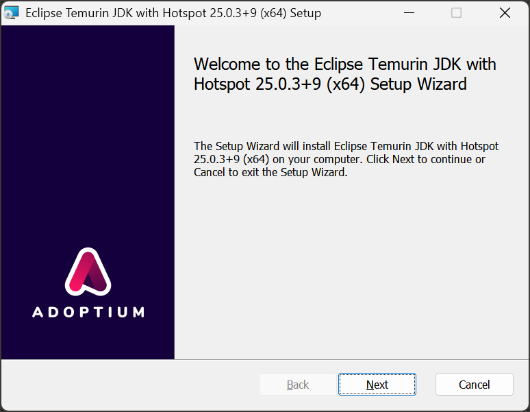
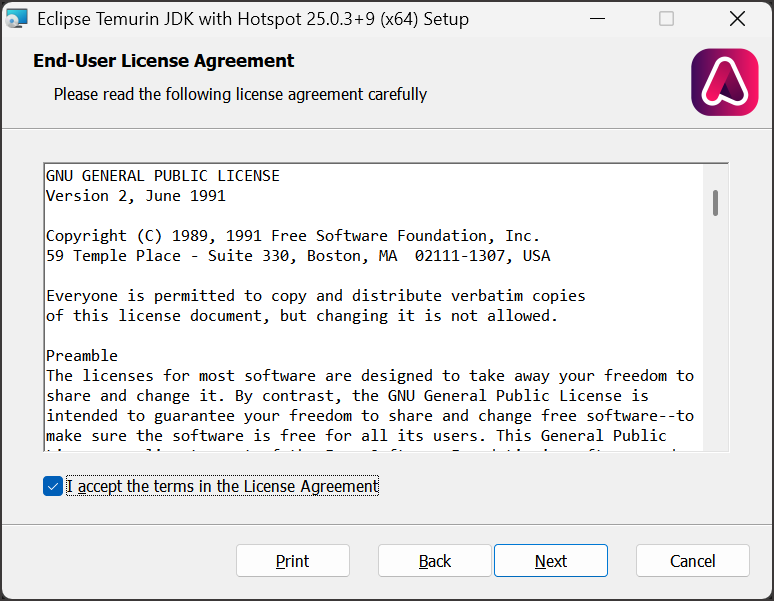
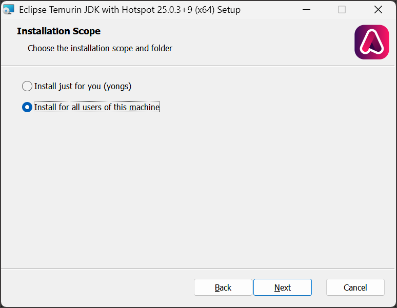
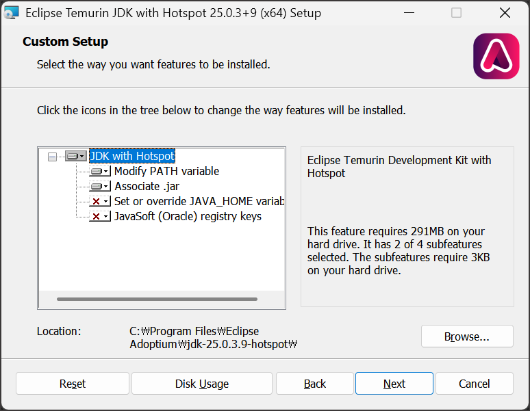
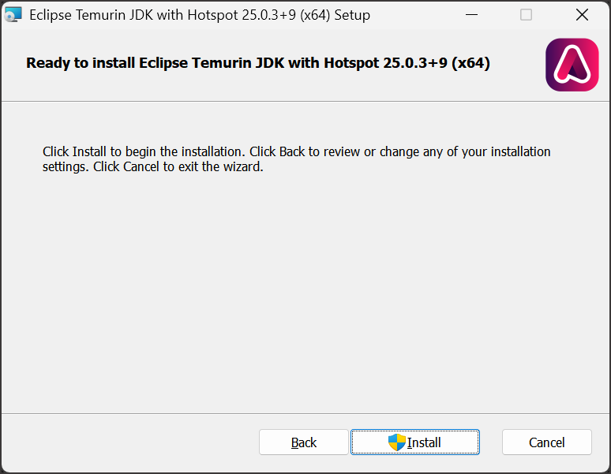
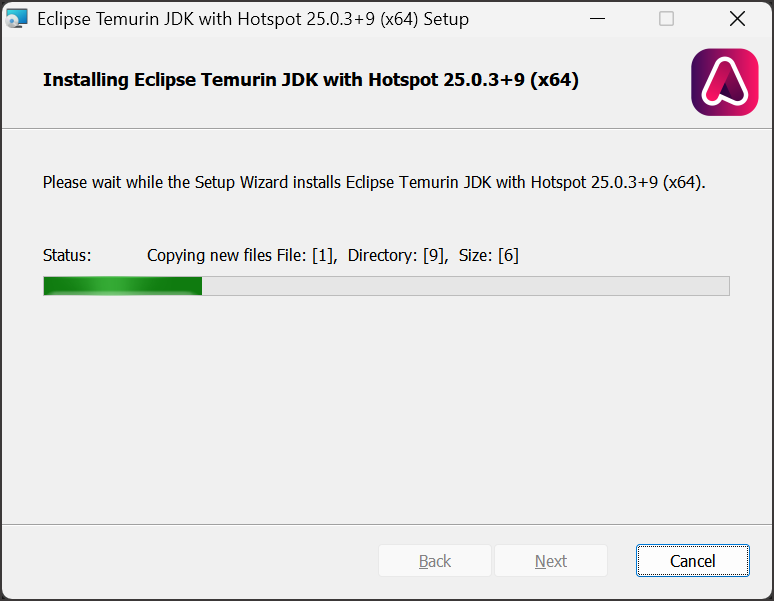
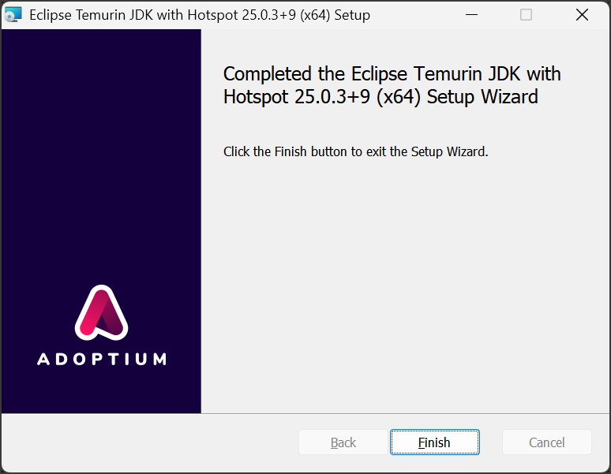

#### 3) 설치 확인
##### 1. 터미널 실행
- Windows: `Win(윈도우키)` + `R` 누른 후 `cmd` 입력
- macOS: `Command(⌘)` + `Space` 누른 후 `terminal` 입력

##### 2. 터미널에서 입력
```bash
java --version
```

#### 4) 기본 에디터로 Java 코드 실행 테스트
##### 1. 터미널에서 수업에 사용할 폴더를 생성하고 해당 폴더로 이동
- Windows
  ```bash
  # 루트 디렉토리로 이동
  cd \
  # bebc25 폴더 생성
  mkdir bebc25
  # bebc25 폴더로 이동
  cd bebc25
  ```

  - 액세스가 거부되었다는 오류 발생 시 탐색기 실행 후 C 드라이브에 `bebc25` 폴더 생성

- Mac
  ```bash
  # 사용자 홈 디렉토리로 이동
  cd ~
  # bebc25 폴더 생성
  mkdir bebc25
  # bebc25 폴더로 이동
  cd bebc25
  ```


##### 2. java 실습 폴더 생성
- java 실습 폴더 생성 후 이동
```bash
# mkdir java_본인이니셜
mkdir java_yong
cd java_yong
```

##### 3. 코드를 작성할 폴더 생성 후 이동
```bash
mkdir workspace
cd workspace
```

  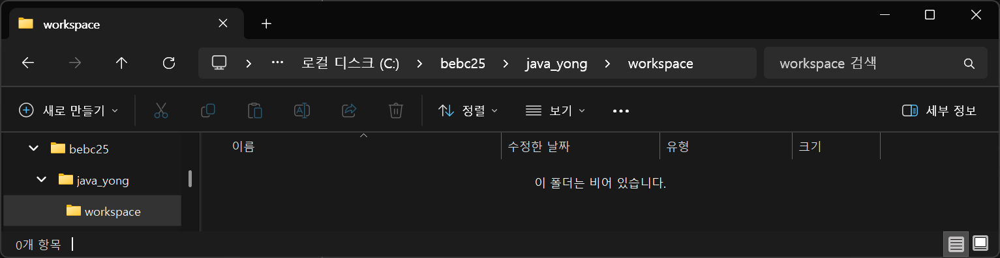

##### 4. 텍스트 편집기 실행
- Windows: `메모장` 실행
  ```bash
  notepad HelloWorld.java
  ```
- macOS: `텍스트 편집기` 실행
  ```bash
  # 파일 생성
  touch HelloWorld.java
  # TextEdit로 열기
  open -e HelloWorld.java
  ```
  + 왼쪽 상단 메뉴 바에서 텍스트편집기 > 설정... 클릭 (또는 단축키 `Command(⌘)` + `,`)
  + 새문서 탭 > 포맷 항목에서 `일반 텍스트` 선택
  + 하단의 옵션에서 `Smart quotes and dashes in rich text documents only` 체크 ✅

##### 5. 코드 작성
```java
public class HelloWorld {
  public static void main(String[] args){
    System.out.println("Hello World!!!");
  }
}
```

##### 6. 저장
- Windows: `Ctrl` + `S`
- macOS: `Command(⌘)` + `S`
  + `.java'를 사용하시겠습니까, 아니면 '.txt'를 사용하시겠습니까?` 메세지가 나올 경우 `.java 사용` 클릭

##### 7. 컴파일
```bash
# 아무런 메세지가 없으면 컴파일 성공
# 에러 메세지가 있을 경우 에러 수정 후 다시 컴파일
javac HelloWorld.java
```

##### 8. 실행
```bash
java HelloWorld
```

##### 9. 결과 확인
```bash
Hello World!!!
```

### 1.1.2 IntelliJ 설치

#### 1) 다운로드
- <https://www.jetbrains.com/idea/download>

#### 2) 설치
- 기본 옵션으로 설치

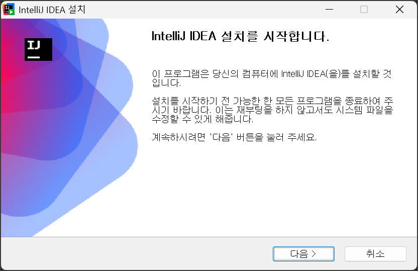
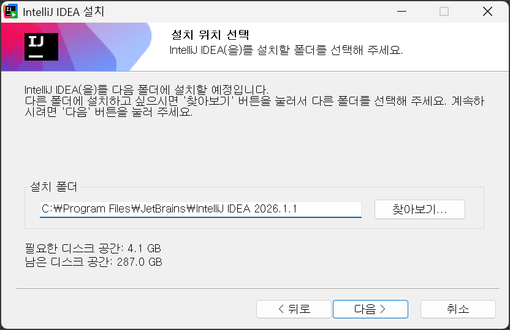
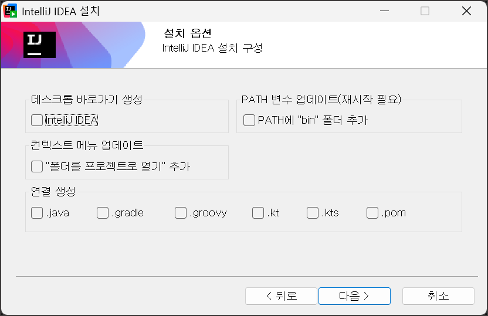
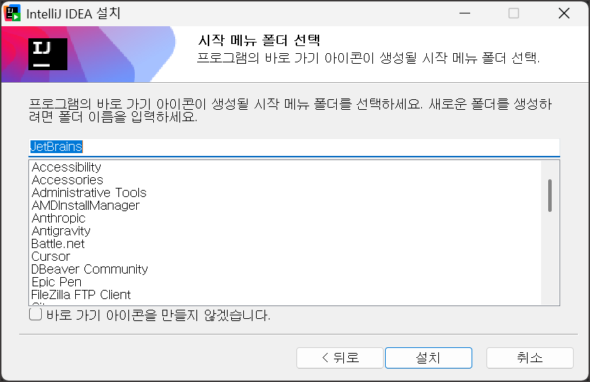
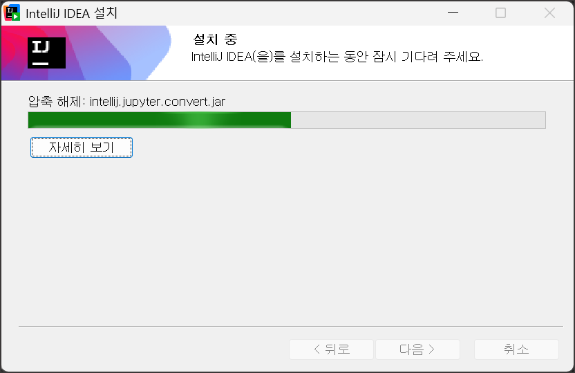
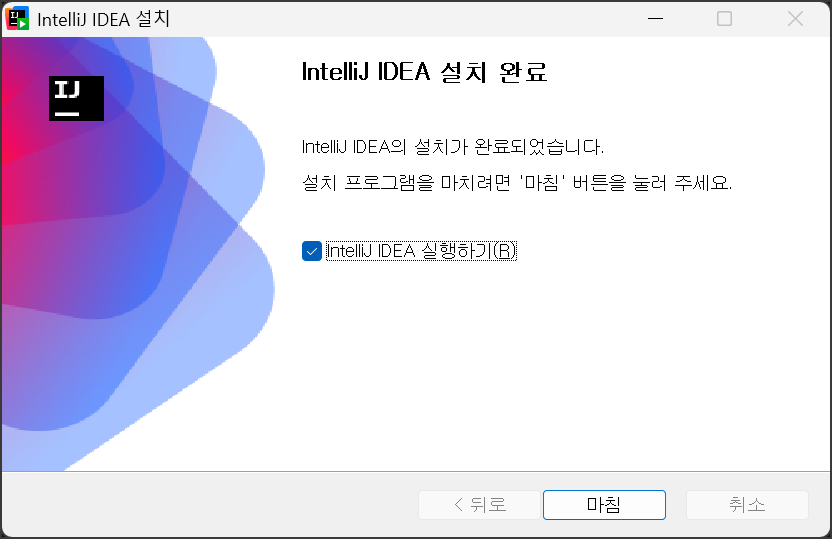

#### 3) IntelliJ로 Java 코드 실행 테스트

##### 1. IntelliJ IDEA 실행

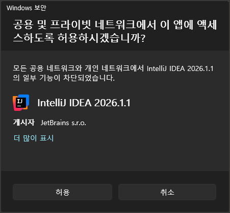
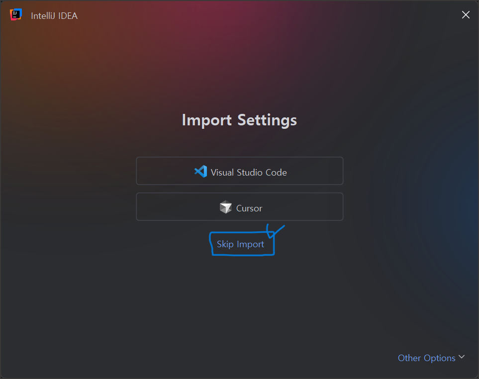

##### 2. Open > java_yong
- [[2. java 실습 폴더 생성]](#2-java-실습-폴더-생성)에서 생성한 폴더 선택


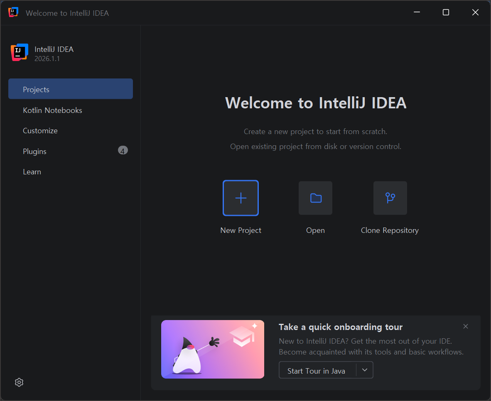

##### 3. 소스 코드 작성
- workspace에서 마우스 우클릭 > New > Java Class
- Name: NewHelloWorld
```java
void main(){
  System.out.println("New Hello World!!!");
}
```

##### 4. 실행
- 단축 아이콘: IntelliJ 상단의 초록색 화살표 아이콘 눌러서 실행
- Main Menu: Run > Run 'NewHelloWorld.java'
- 단축키: Shift + F10

##### 5. 결과 확인
```bash
New Hello World!!!
```

#### 4) IntelliJ 설정
##### 1. 언어 설정
- IntelliJ의 메뉴가 한글로 나올 경우 영어로 설정
- 메인 메뉴 > 설정... > 모양 및 동작 > 시스템 설정 > 언어 및 지역 > 언어: English로 선택하고 `적용`을 누르면 다시 시작할것인지 묻는 대화창에서 `다시 시작` 선택

##### 2. 파일 인코딩 설정 (UTF-8)
- 한글 깨짐 문제 해결
- Main Menu > File > Settings > Editor > File Encodings
- Global Encoding, Project Encoding, Default encoding for properties files를 모두 UTF-8로 변경

##### 3. 컴파일 시 자동 빌드
- 개발 중 실시간 오류 감지
- Main Menu > Settings > Build, Execution, Deployment > Compiler
- Build project automatically를 체크 ✅

##### 4. 에러 무시하고 실행
- 다른 파일의 컴파일 에러를 무시하고 실행
- Main Menu > Run > Edit Configurations...
- Edit configuration templates...
- Application > Modify options > Add before launch task > Build, no error check 선택
- `1. Build`는 x 눌러서 삭제 후 `Apply` 누르고 `OK` 누름
- 한번 더 `OK`

### 1.1.3 Git 설치

#### 1) 다운로드
- <https://git-scm.com/downloads>

#### 2) Git 설치
##### 1. 라이센스 동의 화면에서 `Next`
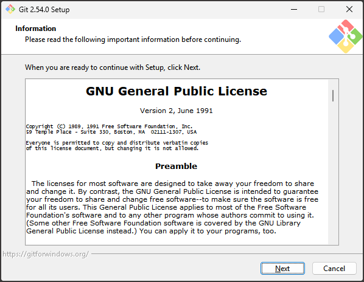

##### 2. 설치 폴더 지정 화면에서 `Next`
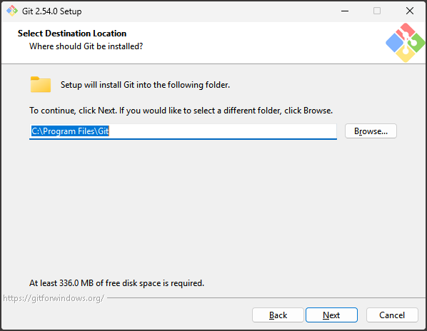

##### 3. 신규 폴더 생성 화면에서 `Next`
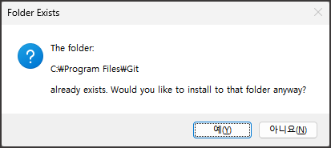

##### 4. 설치할 요소 선택 화면에서 `Next`
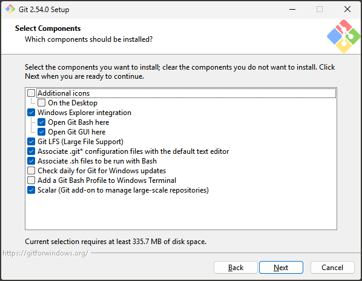

##### 5. 시작 메뉴에 추가 화면에서 `Next`
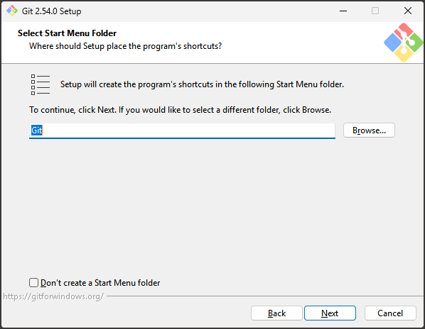

##### 6. 커밋 메시지 입력시 사용할 기본 에디터 선택
- `Use Notepad as Git's default editor`로 변경
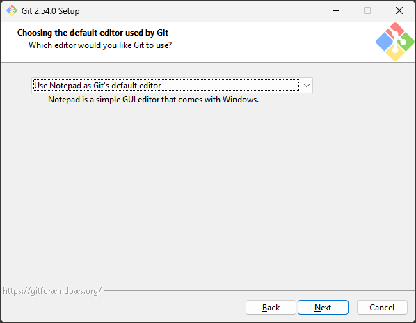

##### 7. 초기 브랜치 이름 변경
- `Override the default branch name for new repositories` 선택
- 브랜치명: `main`
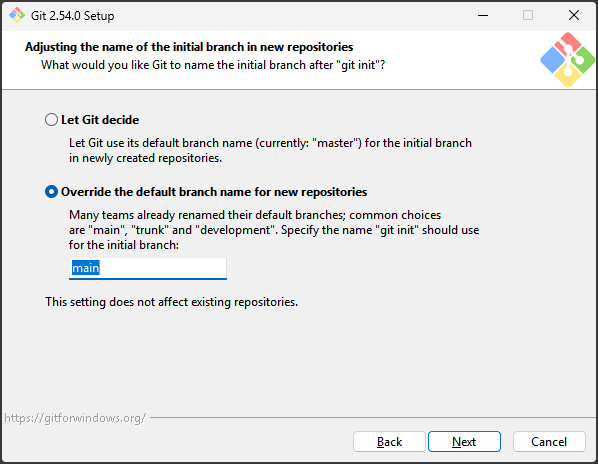

##### 8. git 명령어 path에 등록 여부 선택 화면에서 `Next`
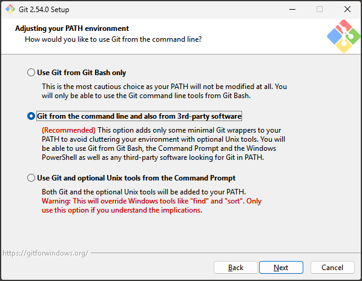

##### 9. ssh 명령어 선택 화면에서 `Next`
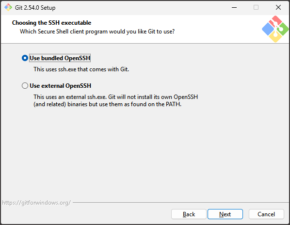

##### 10. HTTPS 통신에 사용할 라이브러리 선택 화면에서 `Next`
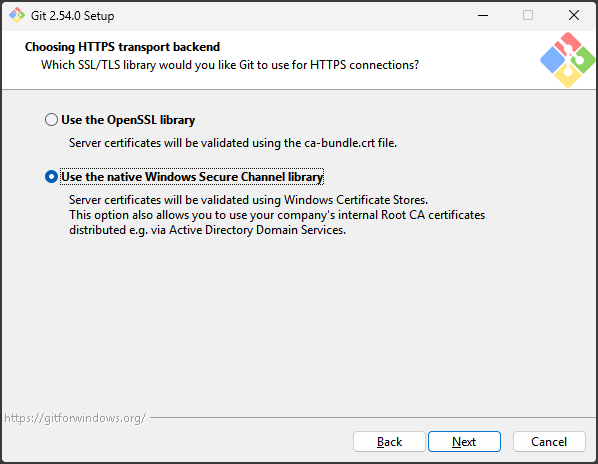

##### 11. 줄바꿈 기호 선택 화면에서 `Next`
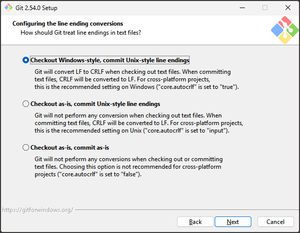

##### 12. 터미널 에뮬레이터 선택 화면에서 `Next`
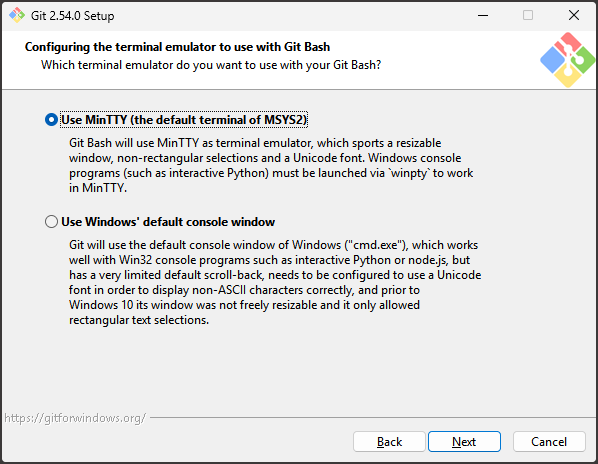

##### 13. Merge 기본 동작 선택 화면에서 `Next`
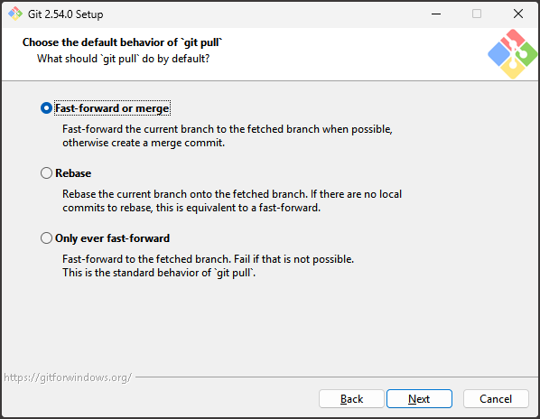

##### 14. 사용자 인증 관리자 지정 화면에서 `Next`
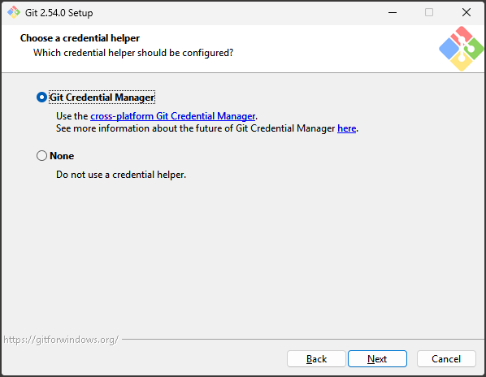

##### 15. 캐시 설정 화면에서 `Next`
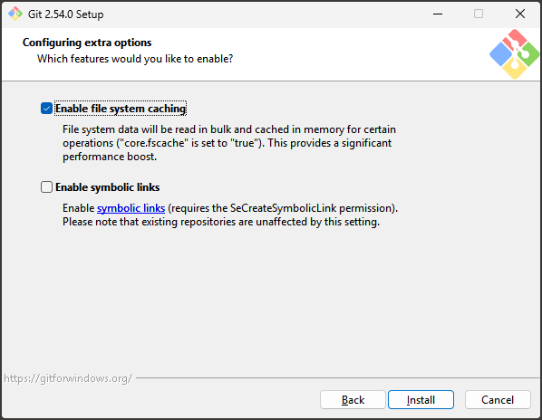

##### 16. 설치중
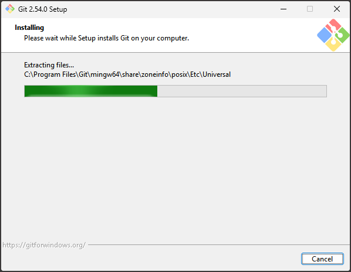

##### 17. 설치 완료
- 쉬는 시간에 컴퓨터 재시작
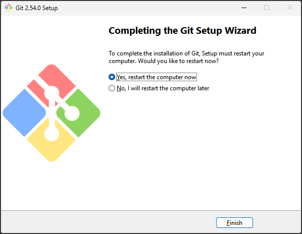

#### 2) 설치 확인
##### 1. 터미널(git bash) 실행
- Windows 사용자는 `git bash`실행
  + `Win(윈도우키)` 누른 후 `git bash` 입력
- macOS 사용자는 `터미널` 실행
  + `Command(⌘)` + `Space` 누른 후 `Terminal` 입력

##### 2. 터미널(git bash)에서 입력
```bash
git --version
```

#### 3) GitHub 계정 생성
- 회원 가입: <https://github.com/signup>

#### 4) Git 설정

##### 1. Commit시 사용할 기본 에디터 지정
  + 현재 설정 확인
    ```bash
    git config core.editor
    ```
  + Windows: Git 설치 시 [[6. 커밋 메시지 입력시 사용할 기본 에디터 선택]](#6-커밋-메시지-입력시-사용할-기본-에디터-선택) 단계에서 `Notepad`로 선택했기 때문에 `core.editor`가 `notepad`로 설정되어 있음
  + macOS
    ```bash
    # open: 파일을 여는 맥 전용 명령어
    # -W: Wait, 파일을 닫을 때까지 터미널이 대기 (커밋 메시지 작성을 완료할 때까지 기다림)
    # -n: new, 새로운 에디터 실행
    # -e: editor, 텍스트 편집기(TextEdit)를 지정
    git config --global core.editor "open -W -n -e"
    ```

##### 2. 기본 브랜치를 `main`으로 지정
  + 현재 설정 확인
    ```bash
    git config init.defaultBranch
    ```
  + Windows: Git 설치 시 [[7. 초기 브랜치 이름 변경]](#7-초기-브랜치-이름-변경) 항목에서 `main`으로 지정했기 때문에 기본값이 `init.defaultBranch`가 `main`으로 설정되어 있음
  + macOS
    ```bash
    git config --global init.defaultBranch main
    ```

##### 3. 줄바꿈 문자 처리 (autocrlf)
- 윈도우는 줄바꿈에 CRLF를, 맥은 LF를 사용하므로 윈도우 사용자(CRLF)가 올린 파일을 맥 사용자(LF)가 내려받으면 줄바꿈 문자가 달라져서, 코드 수정이 없어도 파일 전체가 변경된 것으로 인식되는 문제 발생
- 로컬에는 각자 플랫폼에 맞는 줄바꿈을 사용하고 저장소에는 항상 LF로 통일하기 위한 옵션
- 현재 설정 확인
  ```bash
  git config core.autocrlf
  ```
- Windows: Git 설치 시 [[11. 줄바꿈 기호 선택 화면]](#11-줄바꿈-기호-선택-화면에서-next) 항목에서 기본값이 `core.autocrlf`가 `true`로 설정되어 있음
  + 내보낼 때 (Commit): 윈도우의 CRLF를 Git 표준인 LF로 자동 변환해서 저장소에 올림
  + 가져올 때 (Checkout): 저장소의 LF를 다시 윈도우 환경에 맞는 CRLF로 변환해서 내려받음
- macOS: Commit 시에만 CRLF -> LF 변환하도록 지정
  ```bash
  git config --global core.autocrlf input
  ```

##### 4. 사용자 정보 등록
```bash
# 영문 실명 권장
git config --global user.name "본인이름"
# GitHub 계정과 연동을 위해 GitHub에 가입한 이메일주소 권장
git config --global user.email "이메일주소"
```

##### 5. 등록한 전체 설정 확인
```bash
# Windows
  # core.autocrlf=true
  # init.defaultbranch=main
  # core.editor=notepad
  # user.name=kilyong jeong
  # user.email=uzoolove@gmail.com
# macOS
  # core.autocrlf=input
  # init.defaultbranch=main
  # core.editor=open -W -n -e
  # user.name=kilyong jeong
  # user.email=uzoolove@gmail.com
git config --list
```  

## 1.2 실습 준비

### 1.2.1 Git으로 실습 폴더 관리
- [[2. java 실습 폴더 생성]](#2-java-실습-폴더-생성)에서 생성한 폴더를 Git으로 관리

#### 1) Git 저장소 초기화 (최초 한번만)
- 해당 폴더를 Git이 관리하는 공간으로 선언
- 이 명령어를 실행하면 폴더 내에 숨겨진 .git 디렉토리가 생성되며, 이때부터 Git이 파일의 변경 사항을 추적할 수 있게 됨
```bash
git init
```

#### 2) 파일을 스테이징 영역(Staging Area)에 추가
- 새로운 파일 추적 (Track): Git이 아직 관리하지 않는 새 파일(Untracked)을 관리 대상에 포함
- 수정 사항 기록: 이미 관리 중인 파일(Tracked)에서 발생한 변경 내용을 Staging Area(준비 영역)에 반영
```bash
# 현재 폴더의 특정 파일만 대상으로 할 경우
# git add 파일명

# 현재 폴더의 모든 파일을 대상으로 할 경우
git add .
```

#### 3) 커밋 예정 파일 확인 (선택사항)
```bash
git status
```

#### 4) 최종 커밋 생성
- 스테이징 영역에 올라온 파일들을 하나의 버전으로 기록
- 커밋 메세지(작업 내역 설명)를 직접 입력할 경우
  ```bash
  git commit -m "첫 번째 커밋 메세지"
  ```

- [[1. Commit시 사용할 기본 에디터 지정]](#1-commit시-사용할-기본-에디터-지정) 에서 설정한 에디터로 커밋 메세지(작업 내역 설명)를 입력할 경우
  ```bash
  git commit
  ```

#### 5) 원격 레포지토리(저장소)에 변경사항 업로드
##### 1. GitHub 레포지토리 생성
- GitHub 접속: <https://github.com/>
- 로그인
- 우측 상단의 사용자 아이콘 클릭 > Repositories 선택
- `New` 클릭
  + Repository name: java-yong ([[2. java 실습 폴더 생성]](#2-java-실습-폴더-생성)에서 생성한 폴더명)
  + Description: `멋쟁이 사자처럼 백엔드 부트캠프 25기 Java 저장소`
  + `Create repository` 클릭
- 레포지토리 주소 복사
  + 레포지토리 화면에서 `Code` 선택시 나오는 주소 복사

##### 2. 원격 레포지토리 주소 등록 (최초 한번만)
```bash
git remote add origin 레포지토리주소
```

##### 3. 원격 레포지토리에 변경사항 업로드
- 최초로 push 할 경우
  ```bash
  # -u: 로컬의 main 브랜치와 원격 저장소(origin)의 main 브랜치를 연결
  # origin: 위에서 등록한 레포지토리
  # main: 브랜치명
  git push -u origin main
  ```
  + GitHub 로그인 창이 뜨면 `Sigh in with your browser` 클릭해서 로그인

    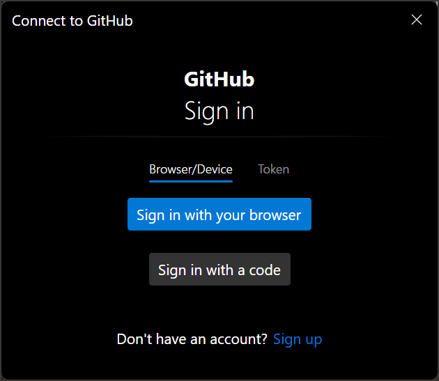

- 이후에 push 할 경우
  ```bash
  git push
  ```

#### 6) 첫번째 push 이후 코드 변경사항을 업로드 할때 필요한 명령어
```bash
# 현재 폴더의 모든 파일을 스테이징 영역(Staging Area)에 추가
git add .
# 스테이징 영역에 올라온 파일들을 하나의 버전으로 기록
git commit -m "커밋 메세지 입력"
# 원격 레포지토리에 업로드
git push
```

### 1.2.2 원격 레포지토리 복사
- 강사의 Java 실습 Github 주소
  + <https://github.com/BEBC-25/java-yong>

- 강사의 Java 실습 Github 레포지토리 주소
  + <https://github.com/BEBC-25/java-yong.git>

- 원격 레포지토리를 로컬에 복사
  ```bash
  # workspace 폴더에서 실행
  git clone https://github.com/BEBC-25/java-yong.git
  ```

- 원격 레포지토리의 최신 변경사항 가져오기
  ```bash
  git pull
  ```

### 1.2.3 IntelliJ에서 소스코드의 차이점 비교
- Student.js, Ins.js 파일 내용을 비교할 경우의 예시
- IntelliJ의 Project 트리에서 Student.java 파일을 마우스 오른쪽 클릭하고 Compare With... 선택
- 파일 선택창이 뜨면 Ins.js 선택
- 두개의 파일이 나란히 보여지고 다른 부분이 표시됨

# 참고 사이트
## 자바 학습
- 위키 독스 점프 투 자바: <https://wikidocs.net/book/31>
- 위키 독스 프로그래밍 입문자를 위한 Java 기초: <https://wikidocs.net/book/2970>
- Oracle Java Tutorials (dev.java): <https://dev.java/learn>

## 코딩 테스트
- 프로그래머스 코딩 테스트
  + <https://school.programmers.co.kr/learn/challenges>
  + 자바 기초 트레이닝: <https://school.programmers.co.kr/learn/challenges/training?languages=java>
  + 자바 입문: <https://school.programmers.co.kr/learn/challenges/beginner?languages=java>
  + 자바 레벨 1: <https://school.programmers.co.kr/learn/challenges?languages=java&levels=1>

